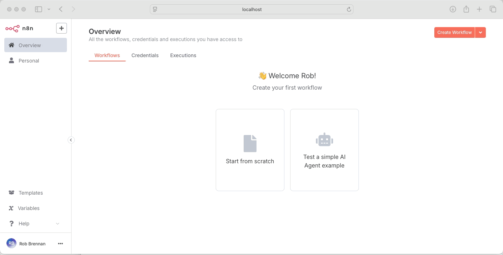
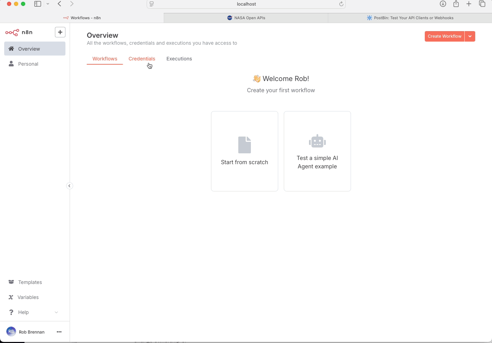

# Explore n8n

## Demo

### Hello World Workflow



### n8n Quickstart - Your first workflow

[](workflows/examples/n8n-quickstart-your-first-workflow/README.md)

### NASA Astronomy Picture of the Day (APOD) MMS

[](workflows/examples/nasa-astronomy-picture-of-the-day-mms/README.md)

Send NASA's Astronomy Picture of the Day directly to your phone via MMS using Twilio. Includes support for both images and video content.

This repository contains explorations and automations using [n8n](https://n8n.io/), a workflow automation tool. It's designed to help you quickly spin up n8n in Docker and explore its capabilities.

## Features

- 🐳 Docker Compose setup for easy n8n development
- 📁 Organized workflow examples with documentation
- 🔄 Persistent storage for your n8n data
- 🚀 Quick start with example workflows

## Prerequisites

- [Docker](https://www.docker.com/) (v20.10+ with Docker Compose v2.0+)
- [Node.js](https://nodejs.org/) (v20 LTS or higher, for development)
- [act](https://github.com/nektos/act) (v0.2.45+, for local GitHub Actions testing)

## Quick Start

1. Clone this repository and install dependencies:

   ```bash
   git clone https://github.com/TheRobBrennan/explore-n8n.git
   cd explore-n8n
   npm install
   ```

2. Start n8n:

   ```bash
   npm start
   ```

3. Access the n8n editor:
   [http://localhost:5678](http://localhost:5678)

4. (Optional) Import example workflows from the `workflows/examples/` directory.

## Project Structure

```text
.
├── docker-compose.yml    # Docker Compose configuration for n8n
├── n8n/                  # Persistent n8n data
│   ├── data/            # n8n database and workflow storage
│   └── config/          # n8n configuration files
├── workflows/            # Directory for n8n workflows
│   └── examples/         # Example workflows
│       └── hello-world/  # Example workflow
│           ├── README.md # Documentation for the example
│           └── workflow.json  # The workflow definition
├── .env.example         # Example environment variables
└── docs/                # Additional documentation
```

## Persistent Configuration

Your n8n configuration and data are persisted in the `n8n/` directory:

- `n8n/data/`: Contains the SQLite database, workflow files, and other persistent data
- `n8n/config/`: Stores n8n configuration files

### Environment Variables

Copy `.env.example` to `.env` and update the values:

```bash
cp .env.example .env
# Edit .env with your preferred editor
```

### Backing Up Your Data

To back up your n8n data, simply copy the `n8n/` directory:

```bash
cp -r n8n/ n8n-backup-$(date +%Y%m%d)
```

## Managing n8n

You can manage the n8n instance using the following npm scripts:

### Start n8n

```bash
npm start
```

### Stop n8n

```bash
npm stop
```

### View logs

```bash
npm run logs
```

### Restart n8n

```bash
npm run restart
```

### Reset n8n (clears all data)

⚠️ **Warning**: This will permanently delete all workflows and data.

```bash
npm run docker:clean
npm start
```

### Rebuild the n8n container

```bash
npm run docker:build
```

## Adding New Workflows

1. Create a new directory under `workflows/` for your workflow
2. Add a `workflow.json` file with your n8n workflow
3. Document your workflow in a `README.md` file
4. (Optional) Add screenshots to help explain the workflow

## Troubleshooting

### Port 5678 is already in use

If you get a port conflict, you can change the port in `docker-compose.yml`:

```yaml
ports:
  - "5678:5678"  # Change the first number to an available port
```

### Clean up Docker resources

To completely remove all Docker resources (containers, networks, volumes):

```bash
docker system prune -a --volumes
```

## Development

### Available Scripts

#### Docker Management

- `npm start` - Start n8n in detached mode
- `npm stop` - Stop and remove the n8n container
- `npm run restart` - Restart the n8n container
- `npm run logs` - View container logs
- `npm run docker:build` - Rebuild the n8n container
- `npm run docker:clean` - Remove containers and volumes (⚠️ destructive)

#### Testing

- `npm test` - Run all workflow tests
- `npm run test:workflows` - Test GitHub Actions workflows locally
- `npm run test:workflows:semantic` - Test semantic PR checks
- `npm run test:workflows:semantic:major` - Test major version bump
- `npm run test:workflows:semantic:minor` - Test minor version bump
- `npm run test:workflows:semantic:patch` - Test patch version bump
- `npm run test:workflows:semantic:invalid` - Test invalid version bump
- `npm run test:workflows:merge` - Test merge workflow

### Testing GitHub Actions Locally

We recommend using [act](https://github.com/nektos/act) to test GitHub Actions workflows locally before pushing changes.

Prerequisites for macOS:

- Homebrew
- Docker Desktop (must be running)

```sh
# Install act using Homebrew
brew install act

# Verify installation
act --version
```

## Contributing

1. Create a feature branch following the `YYYY.MM.DD/description` format
2. Make your changes
3. Submit a pull request
