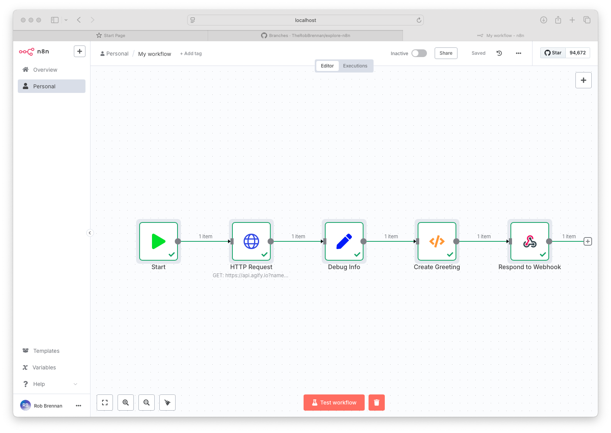

# Hello World Workflow

This is a simple example workflow that demonstrates basic n8n functionality.

## Overview

- Uses the HTTP Request node to fetch data from an API
- Processes the data with a Function node
- Outputs a greeting message

## Screenshot



*Figure 1: The Hello World workflow in n8n*

## How to Use

1. Import the `workflow.json` file into your n8n instance
2. The workflow will be available in the "Hello World" collection
3. Click "Execute Workflow" to run it

## Workflow Details

### Nodes Used

1. **HTTP Request Node**: Makes a GET request to `https://api.agify.io`
2. **Function Node**: Processes the response and creates a greeting
3. **Respond to Webhook Node**: Returns the final output

### Input/Output

- **Input**: None required
- **Output**: A greeting message with a name and age prediction

## Example Output

```json
{
  "greeting": "Hello, John! You are probably 55 years old."
}
```
