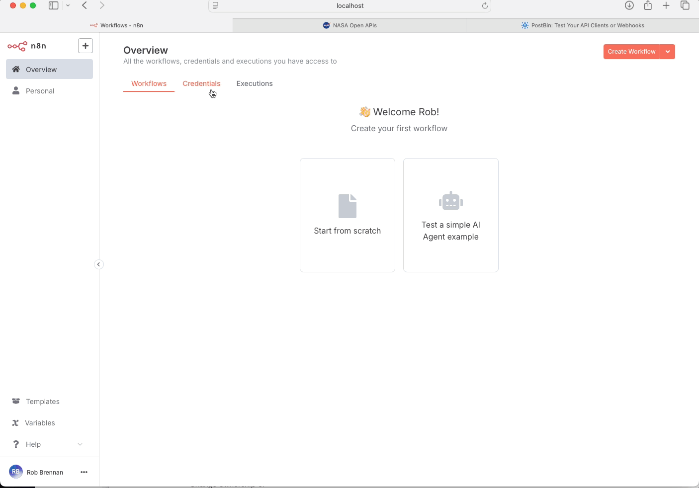

# n8n Quickstart - Your first workflow

This is a corrected implementation of the [n8n First Workflow Tutorial](https://docs.n8n.io/try-it-out/tutorial-first-workflow/).

## Screencast

## Overview

This workflow demonstrates how to use n8n to monitor NASA's solar flare data and receive notifications. It checks for solar flares and sends the data to a PostBin endpoint for monitoring.

## Workflow Steps

1. **Schedule Trigger**: Runs the workflow on a schedule (currently set for weekly)
2. **NASA Node**: Fetches solar flare data from the NASA API
3. **Condition Check**: Filters for significant solar flares (class X)
4. **HTTP Request**: Sends the flare data to a PostBin endpoint

## Setup

1. **NASA API Key**:
   - Get a free API key from [NASA API Portal](https://api.nasa.gov/)
   - Add it to your n8n credentials

2. **PostBin Setup**:
   - Create a new bin at [PostBin](https://postb.in/)
   - Update the `binId` in the HTTP Request nodes with your PostBin ID

3. **Testing**:
   - Use the "Execute Workflow" button to test manually
   - Check your PostBin to see the results

## Related Resources

- [n8n Documentation](https://docs.n8n.io/)
- [First Workflow Tutorial](https://docs.n8n.io/try-it-out/tutorial-first-workflow/)
- [NASA API Documentation](https://api.nasa.gov/)
- [PostBin](https://postb.in/)
