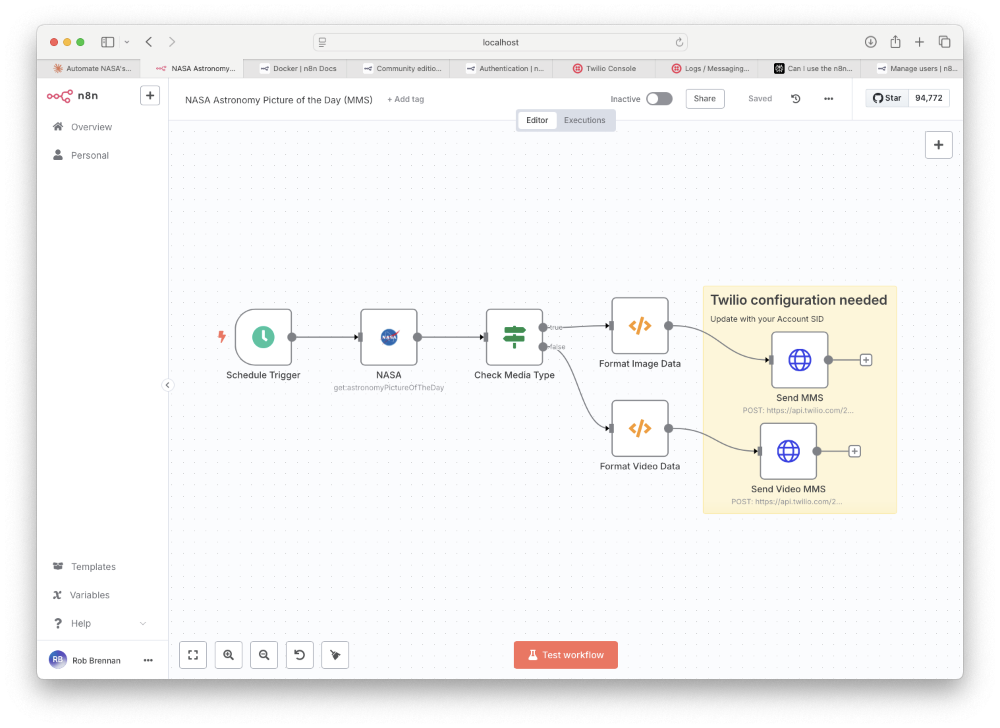

# NASA Astronomy Picture of the Day MMS

[](./screencast.gif)

This workflow automatically fetches NASA's Astronomy Picture of the Day (APOD) and sends it as an MMS message via Twilio. It handles both image and video content types, providing a formatted message with details about the APOD.

## Screenshots

| Workflow Configuration | Example MMS |
|-----------------------|-------------|
|  |  |

## Features

- Fetches the latest NASA APOD daily
- Handles both image and video content types
- Sends formatted MMS messages with media
- Includes title, explanation, and copyright information
- Scheduled to run once per day

## Prerequisites

1. **NASA API Key**
   - Get a free API key from [NASA API Portal](https://api.nasa.gov/)
   - Add it to your `.env` file as `NASA_API_KEY`

2. **Twilio Account**
   - Sign up at [Twilio](https://www.twilio.com/)
   - Add the following to your `.env` file:

     ```bash
     TWILIO_ACCOUNT_SID=your_account_sid
     TWILIO_ACCOUNT_SECRET=your_auth_token
     ```

   - Get a Twilio phone number with MMS capabilities

## Setup

1. Import the workflow into your n8n instance
2. Update the following in the workflow:
   - Twilio "From" phone number
   - Recipient "To" phone number
   - **Important**: Manually update the Twilio Account SID in the HTTP request nodes (both "Send MMS" and "Send Video MMS") as the workflow currently can't read it from credentials
3. Ensure your Twilio credentials are set up in n8n
4. The workflow is scheduled to run daily, but you can trigger it manually for testing

## Workflow Overview


1. **Schedule Trigger**: Runs the workflow daily
2. **NASA Node**: Fetches the Astronomy Picture of the Day
3. **Check Media Type**: Routes based on content type (image or video)
4. **Format Data**: Structures the message with appropriate media URL
5. **Send MMS**: Uses Twilio to send the formatted message with media

## Message Format

For images:

```text
[Image: NASA APOD - Title]

Brief explanation...

Copyright: [Photographer/Organization]
```

For videos:

```text
[Video: NASA APOD - Title]

Brief explanation...

Video: [Direct Video URL]
Copyright: [Photographer/Organization]
```

## Customization

- Adjust the message format in the "Format Image Data" and "Format Video Data" function nodes
- Modify the schedule in the "Schedule Trigger" node
- Add error handling or additional processing as needed

## Troubleshooting

- Ensure your Twilio account has sufficient balance for MMS messages
- Verify that your Twilio phone number has MMS capabilities
- Check n8n execution logs for any API errors
- Make sure your NASA API key is valid and has not exceeded rate limits

## License

This workflow is provided as-is under the MIT License.
